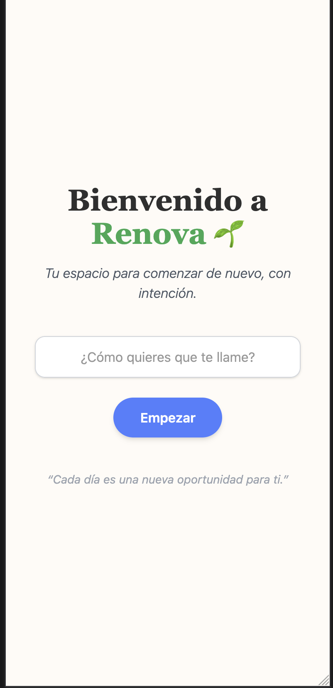
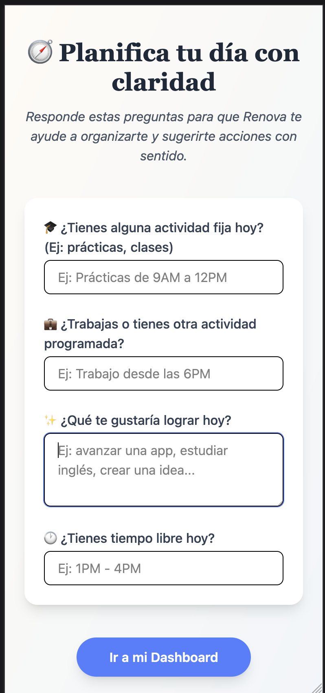

# 🌱 Renova — Tu espacio para comenzar de nuevo, cada día

Renova es una aplicación minimalista diseñada para ayudarte a reconectar contigo mismo y planificar tu día con intención. Ideal para quienes buscan claridad, enfoque y autogestión diaria.

## ✨ Funcionalidades

- 👋 Login con alias personalizado
- 🧠 Planificación diaria guiada
- 📅 Visualización del día con calendario tipo agenda
- ✅ Recordatorios motivacionales y microacciones
- 💬 Sugerencias inteligentes según tus metas
- 🔁 Edición de planificación en cualquier momento

## 🖼️ Vista previa

   


## 🚀 Instalación

1. Clona este repositorio:

```bash
git clone https://github.com/tu_usuario/renova-app.git
cd renova-app
```

2. Instala las dependencias:

```bash
yarn install
# o
npm install
```

3. Inicia la app:

```bash
yarn dev
# o
npm run dev
```

## 🧠 Tecnologías usadas

- React + Vite
- TailwindCSS
- React Router DOM
- LocalStorage (persistencia)
- Diseño UI minimalista inspirado en apps como Notion y Recordatorios (Apple)

## 📦 Estructura de carpetas

```
src/
├── assets/
├── components/
├── pages/
├── utils/
├── App.jsx
└── main.jsx
```

## 📌 Próximas mejoras

- Integración con Google Login
- Recordatorios push
- Sincronización en la nube
- Estadísticas semanales de hábitos

## 🧑‍💻 Autor

Desarrollado por Darikson Anyosa | [LinkedIn](https://www.linkedin.com/in/...)

---

“Cada día es una nueva oportunidad para ti.” ✨
